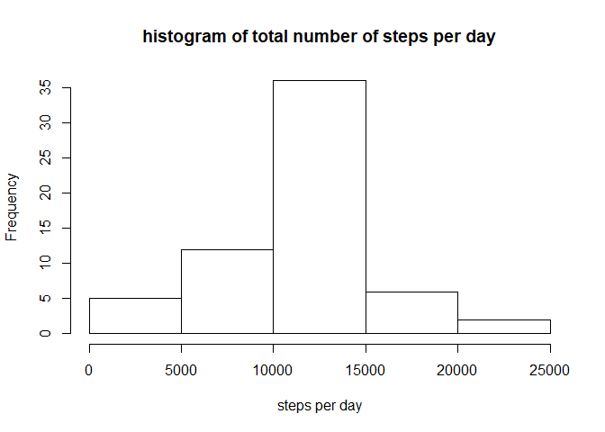

## Loading and preprocessing the data

```r
unzip("activity.zip")
data<-read.csv("activity.csv")
options(warn = -1)
```

## What is mean total number of steps taken per day?

```r
library(dplyr)
```

```
## 
## Attaching package: 'dplyr'
```

```
## The following objects are masked from 'package:stats':
## 
##     filter, lag
```

```
## The following objects are masked from 'package:base':
## 
##     intersect, setdiff, setequal, union
```

```r
databydate<-group_by(data, date)
sumdata<-summarise(databydate, stepsperday=sum(steps))
hist(sumdata$stepsperday,main = "histogram of total number of steps per day", xlab="steps per day")
```

<!-- -->


```r
meansteps<-mean(sumdata$stepsperday, na.rm = TRUE)
mediansteps<-median(sumdata$stepsperday, na.rm = TRUE)
```
The mean and median of the total number of steps taken per day: mean 1.0766189\times 10^{4} and median 10765

## What is the average daily activity pattern?

```r
intervalsteps<-group_by(data, interval)
sumdata2<-summarise(intervalsteps, meansteps=mean(steps,na.rm = TRUE))
plot(sumdata2$interval, sumdata2$meansteps, type="l", ylab = "steps", xlab="interval")
```

<!-- -->

Which 5-minute interval, on average across all the days in the dataset, contains the maximum number of steps?

```r
sumdata2[which.max(sumdata2$meansteps),1]
```

```
## # A tibble: 1 x 1
##   interval
##      <int>
## 1      835
```

## Imputing missing values
Calculate and report the total number of missing values in the dataset:

```r
sum(is.na(data$steps))
```

```
## [1] 2304
```

Imputing strategy: use the mean of the 5-minute interval, on average across all the days, for the missing values.

```r
impute<-function(data, sumdata2){
  for(i in 1:nrow(data)){
    if(is.na(data$steps[i])){
      data[i,1]<-sumdata2[which(sumdata2$interval==data[i,3]),2]
    }
  }
  data
}
nonadata<-impute(data, sumdata2)
head(nonadata)
```

```
##       steps       date interval
## 1 1.7169811 2012-10-01        0
## 2 0.3396226 2012-10-01        5
## 3 0.1320755 2012-10-01       10
## 4 0.1509434 2012-10-01       15
## 5 0.0754717 2012-10-01       20
## 6 2.0943396 2012-10-01       25
```


```r
databydate2<-group_by(nonadata, date)
sumdata2<-summarise(databydate2, stepsperday=sum(steps))
hist(sumdata2$stepsperday,main = "histogram of total number of steps per day", xlab="steps per day")
```

<!-- -->


```r
meansteps2<-mean(sumdata2$stepsperday)
mediansteps2<-median(sumdata2$stepsperday)
```
The mean and median of the total number of steps taken per day: mean 1.0766189\times 10^{4} and median 1.0766189\times 10^{4}

After imputing the missing values, the mean remains the same, but the median changed slightly.


## Are there differences in activity patterns between weekdays and weekends?

```r
nonadata$date<-as.Date(nonadata$date)
nonadata$type<-sapply(nonadata$date, function(x) {
        if (weekdays(x) == "星期六" | weekdays(x) =="星期日") 
                {y <- "Weekend"} else 
                {y <- "Weekday"}
                y
        })
head(nonadata)
```

```
##       steps       date interval    type
## 1 1.7169811 2012-10-01        0 Weekday
## 2 0.3396226 2012-10-01        5 Weekday
## 3 0.1320755 2012-10-01       10 Weekday
## 4 0.1509434 2012-10-01       15 Weekday
## 5 0.0754717 2012-10-01       20 Weekday
## 6 2.0943396 2012-10-01       25 Weekday
```


```r
data3<-group_by(nonadata, type, interval)
sumdata3<-summarise(data3, meansteps=mean(steps))
library(lattice)
xyplot(meansteps~interval|type, data=sumdata3, type="l",ylab = "Average Number of Steps")
```

<!-- -->

